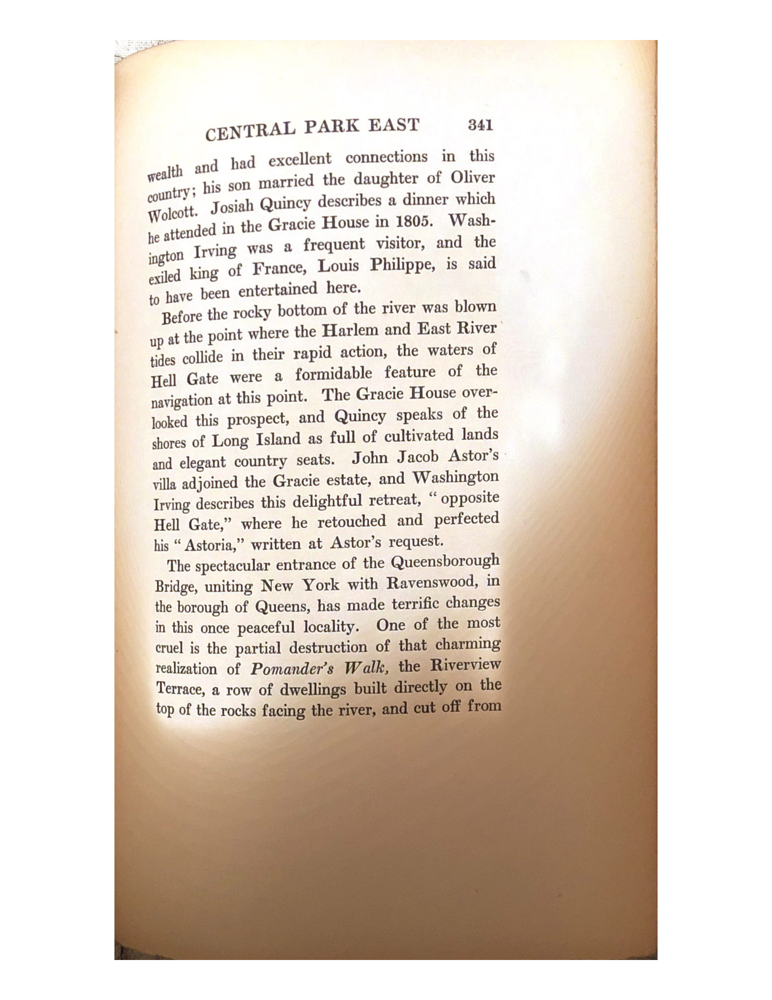
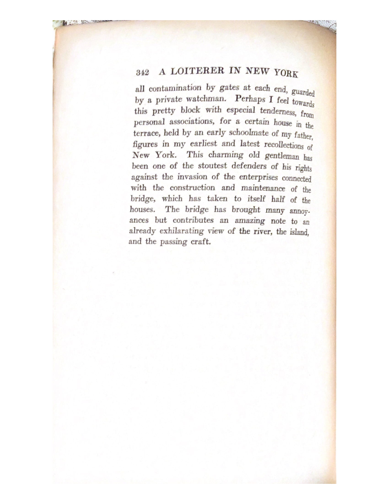

A Loiterrer in New York Excerpt
===

&nbsp;&nbsp;&nbsp;&nbsp;&nbsp;&nbsp;&nbsp;&nbsp;&nbsp;&nbsp;&nbsp;&nbsp;&nbsp;&nbsp;&nbsp;&nbsp;&nbsp;&nbsp;&nbsp;&nbsp;&nbsp;&nbsp;&nbsp;&nbsp;&nbsp;&nbsp;&nbsp;&nbsp;CENTRAL PARK EAST &nbsp;&nbsp; 335

<h1 align="center">CENTRAL PARK EAST</h1>
<h2 align="center">CENTRAL PARK EAST</h2>
<h3 align="center">CENTRAL PARK EAST</h3>

correct suburban fashion, on the high banks of
the noblle Hudson; but Yorkville had mystery 
and interest of a richer flavour, commanding the 
passageway to the Sound, bordering on the tur-
bulent waters of Hell Gate, and overlooking the 
islands in the East River.
&nbsp;&nbsp;&nbsp;&nbsp;&nbsp;&nbsp;&nbsp;&nbsp;&nbsp;&nbsp;&nbsp;&nbsp;&nbsp;&nbsp;&nbsp;&nbsp;&nbsp;The boundaries of Yorkville have been vari-
ously described.  From all accounts of nucleus
of the village seems to have llain along the olld
Post Road between Eighty-third and Eighty-
ninth Streets; while its expansions included the 
district east of Fifth Avenue to the river from
Fifty-ninth to One Hundredth Street.  The 
nomenclature of the features of the East River
shore is romantic and suggestive. Kip's Bay
indented the eastern bank of the river at about 
the location of the present ferry slips at Thirty-
fourth Street; it was here that the British landed,
when they took possession of the city, on Sep-
tember 15, 1776, while the quick-witted wife of 
the owner of Incleberg prepared a feast for their
detention.  Until 1851 the old farmhouse of
Jacob Kip, who gave his name to the bay, stood
on Second Avenue near Thirty-fifth Street.

  ---

&nbsp;&nbsp;&nbsp;&nbsp;&nbsp;&nbsp;&nbsp;&nbsp;&nbsp;&nbsp;&nbsp;&nbsp;&nbsp;&nbsp;&nbsp;&nbsp;&nbsp;&nbsp;&nbsp;&nbsp;&nbsp;&nbsp;&nbsp;&nbsp;&nbsp;&nbsp;&nbsp;&nbsp;340&nbsp;&nbsp;A LOITERRER IN NEW YORK 

There was an old house at Horn's Hook,
belonging to Mrs. Provoost, taken by Archibald
Gracie, who built on the site the so-called
" Gracie House,"<a href="#fn1" id="ref1">1</a> now included in the East
River Park. This house in its day saw inter-
esting life and extended princely hospitality, for
its owner was a merchant and shipowner of
 
 ---
  

&nbsp;&nbsp;&nbsp;&nbsp;&nbsp;&nbsp;&nbsp;&nbsp;&nbsp;&nbsp;&nbsp;&nbsp;&nbsp;&nbsp;&nbsp;&nbsp;&nbsp;&nbsp;&nbsp;&nbsp;&nbsp;&nbsp;&nbsp;&nbsp;&nbsp;&nbsp;&nbsp;&nbsp;CENTRAL PARK EAST &nbsp;&nbsp; 341

wealth and had excellent connections in this
country; his son married the daughter of Oliver
Wolcott. Josiah Quincy describes a dinner which
he attended in the Gracie House in 1805. Wash-
ington Irving was a frequent visitor, and the
exciled king of France, Louis Philippe, is said
to have been entertained here.
Before the rocky bottom of the river was blown
up at the point where the Harlem and East River
tides collide in their rapid action, the waters of 
Hell Gate were a formidable feature of the 
navigation at this point. The Gracie House over-
looked this prospect, and Quincy speaks of the 
shores of Long Island as full of cultivated llands
and elegant country seats. John Jacob Astor's 
villa adjoined the Gracie estate, and Washington 
Irving describes this delighful retreat, " opposite 
Hell Gate," where he retouched and perfected 
his "Astoria," written at Astor's request. 
The spectacular entrance of the Queensborough 
Bridge, united New York with Ravenswood, in 
the borough of of Queens, has made terrific changes
in this once peacful locality. One of the most 
cruel is the partial destruction of that charming 
realization of *Pomander's Walk*, the Riverview
Terrace, a row of dwellings built directly on the 
top of the rocks facing the river, andd cut off from

  ---

&nbsp;&nbsp;&nbsp;&nbsp;&nbsp;&nbsp;&nbsp;&nbsp;&nbsp;&nbsp;&nbsp;&nbsp;&nbsp;&nbsp;&nbsp;&nbsp;&nbsp;&nbsp;&nbsp;&nbsp;&nbsp;&nbsp;&nbsp;&nbsp;&nbsp;&nbsp;&nbsp;&nbsp;342&nbsp;&nbsp;A LOITERRER IN NEW YORK 

all contamination by gates at each end, guarded 
by a private watchman. Perhaps I feel towards
this pretty block with especial tenderness, from 
personal associations, for a certain house in the 
terrace, held by an early schoolmate of my father,
figures in my earliest and lates recolelctions of 
New York. This charming old gentlemen has 
been one of the stoutest defenders of his rights
against the invasion of the enterprises connected
with the construction and maintenance of the 
bridge, which has taken to itself half of the
houses. The bridge has brought many annoy-
ances but contributes an amazing note to an 
already exhilarating view of the river, the island,
and the passing craft. 

1. [Now known as Gracie Mansion!]<a href="#ref1" title="Jump back to footnote 1 in the text.">↩</a>

