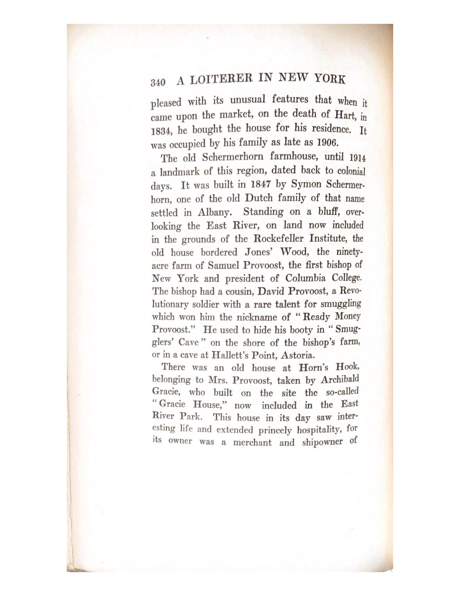

A Loiterrer in New York Excerpt
===

&nbsp;&nbsp;&nbsp;&nbsp;&nbsp;&nbsp;&nbsp;&nbsp;CENTRAL PARK EAST &nbsp;&nbsp; 335

correct suburban fashion, on the high banks of
the noblle Hudson; but Yorkville had mystery 
and interest of a richer flavour, commanding the 
passageway to the Sound, bordering on the tur-
bulent waters of Hell Gate, and overlooking the 
islands in the East River.
&nbsp;&nbsp;&nbsp;The boundaries of Yorkville have been vari-
ously described.  From all accounts of nucleus
of the village seems to have llain along the olld
Post Road between Eighty-third and Eighty-
ninth Streets; while its expansions included the 
district east of Fifth Avenue to the river from
Fifty-ninth to One Hundredth Street.  The 
nomenclature of the features of the East River
shore is romantic and suggestive. Kip's Bay
indented the eastern bank of the river at about 
the location of the present ferry slips at Thirty-
fourth Street; it was here that the British landed,
when they took possession of the city, on Sep-
tember 15, 1776, while the quick-witted wife of 
the owner of Incleberg prepared a feast for their
detention.  Until 1851 the old farmhouse of
Jacob Kip, who gave his name to the bay, stood
on Second Avenue near Thirty-fifth Street.

Hello World!

