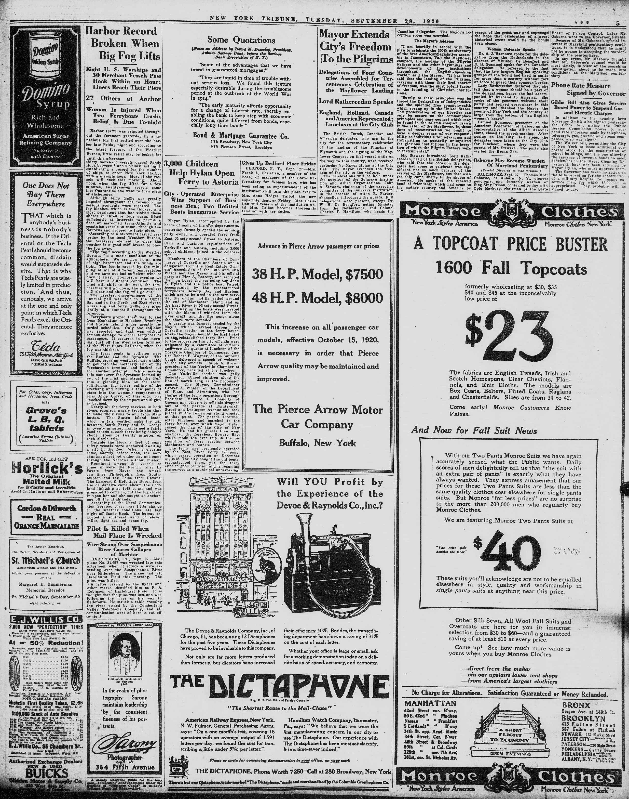

3,000 Children Help Hylan Open Ferry to Astoria
===

   ---
City - Operated Enterprise Wins Support of Business Men; Two Refitted Boats Inaugurate Service

   ---
   
&nbsp;&nbsp;&nbsp;&nbsp;&nbsp;&nbsp;&nbsp;&nbsp;Mayor Hylan, accompanied by the heads of many of the city departments, yesterday formally opened the municipally owned and operated ferry from East Ninety-second Street to Astoria. Civic and business organizations of Yorkville and Astoria, including 3,000 school children, joined in the celebration.

&nbsp;&nbsp;&nbsp;&nbsp;&nbsp;&nbsp;&nbsp;&nbsp;Members of the Chambers of Commerce of Yorkville and Astoria and a deligation from the Real Estate Owner's Association of the 12th and 19th Wards met the Mayor and his official party at Pier A, Battery, and escorted them on board the sea-going tug John F. Hylan and the police boat Patrol. Accompanied by the reconstructed ferryboats Bowery Bay and Harlem, which are to be used in the new service, the official flotilla sailed around the end of Manhatten Island and up the East River to Ninety-second Street. All the way up the boats were greeted with the blasts of whistles from the river craft and the fire gongs along the shore were sounded.

&nbsp;&nbsp;&nbsp;&nbsp;&nbsp;&nbsp;&nbsp;&nbsp;A parade was formed, headed by the Mayor, which marched through the Yorkville section to the ferry house, where the Mayor brought the first ticket on the reëstablished ferry line. Prior to the procession the city officials were welcomed by a committee of citizens and were the guests at luncheon of the Yorkville Chamber of Commerce. Justice Robert F. Wagner, of the Supreme Court, delivered a speech of welcome to the city officials. Ralph A. Brown, president of the Yorkville Chamber of Commerce, presided at the luncheon. 

&nbsp;&nbsp;&nbsp;&nbsp;&nbsp;&nbsp;&nbsp;&nbsp;The Yorkville section was gaily decorated. School children along the line of march sang as the procession passed. The Mayor, Commissioner Grover A. Whalen of the Department of Plant and Structures who has charge of the ferry operation; Borough President Maurice E. Connolly of Queens and other city officials dropped out of the parade at Eighty-sixth Street and Lexington Avenue and took places in the reviewing stand erected at that point. The parade reformed after luncheon and marched to the ferry house, over which 
