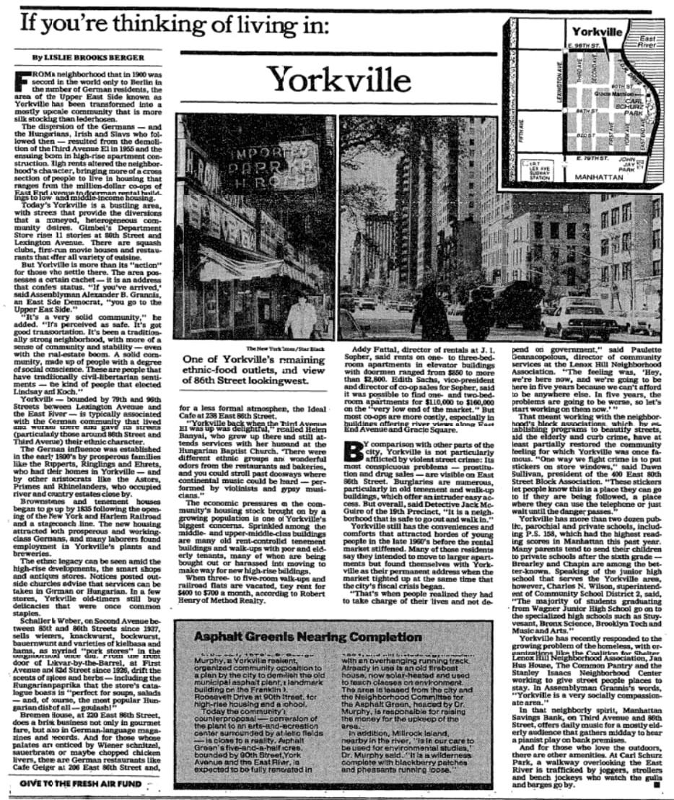

If you're thinking of living in: Yorkville
===
      
         

From a neighborhood that in 1900 was second in the world only to Berlin in the number of German esidents, the area of the Upper East Side known as Yorkville has been transformed into a mostly upscale community that is more silk stocking than lederhosen.

&nbsp;&nbsp;&nbsp;&nbsp;&nbsp;&nbsp;&nbsp;&nbsp;&nbsp;&nbsp;The dispersion of the Germans - and the Hungarians, Irish, and Slavs who followed then - resulted from the demoltion of the Third Avenue El in 1955 and the ensuing boom in high-rise apartment constructions. High rents altered the neighborhood's character, bringing more of a cross section of people to liv in housing that ranges from the million-dollar co-ops of East End Avenue to doorman rental buildings to low- and middle-income housing.

Today's Yorkville is a bustling area, with streets that provide diversions that a moneyed, heterogeneious community desires. Gimbel's Department Store rises 11 stories at 86th Street and Lexington Avenue. There are squash clubs, first-run movie houses and restaurants that offer all variety of cuisine. 

But Yorkville is more than its "action" for those who settle there. The area posseses a certain cachet - it is an address that confers status. "If you've arrived," said Assemblyman Alexander B. Grannis, an East Side Democrat, "you go to the Upper East Side."

"It's a very solid community," he added. "It's percieved as safe. It's got a good transportation. It's been a traditionally strong neighborhood, with more of a sense of community and stability - even with the real-estate boom. A solid community, made up of people with a degree of social conscience. These are people that have traditionally civil-libertarian sentiments - the kind of people that elected Lindsay and Koch."

Yorkville - bounded by 79th and 96th Streets between Lexington Avenue and the East River - is typically associated with the German community that lived and worked there and gave its streets (particularly those around 86th Street and Third Avenue) their ethnic character.

The German influence was established in the early 1800's by prosperous families like the Rupperts, Ringlings, and Ehrets, who had their homes in Yorkville - and by other aristocrats like the Astors, Primes and Rhinelanders, who occupied river and country estates close by.

Brownstones and tenement houses began to go up by 1835 following the opening of the New York and Harlem Railroad and a stagecoach line. The new housing attracted both prosperous and working-class Germans, and many laborers found employemnt in Yorkville's plants and breweries. 
