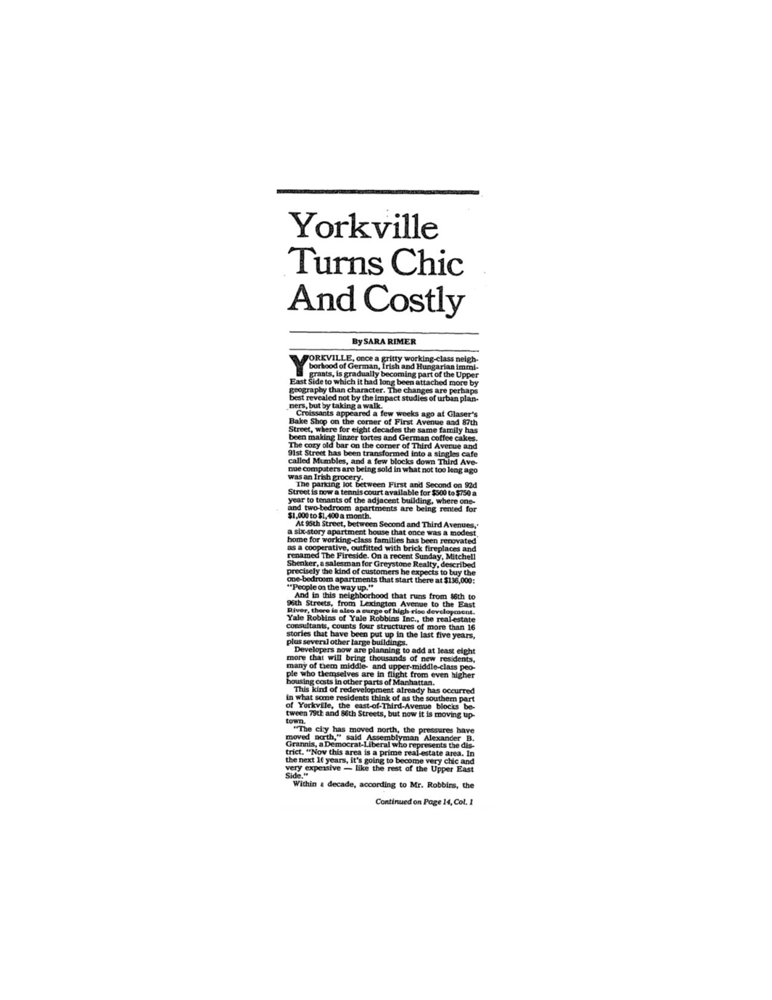
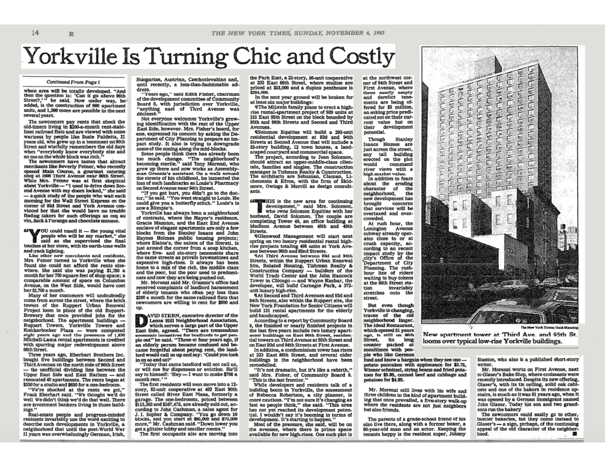

Yorkville Turns Chic and Costly
===

   Yorkville, once a grity working-class neighborhood of German, Irish, and Hungarian immigrants, is gradually becoming part of the Upper East Side to which it had long been attached more by geography than character. The changes are perhaps best revealed not by the impact studies ofurban planners, but by taking a walk.
  
  Croissants appeared a few weeks ago at Glaser's Bake Shop on the corner of First Avenue and 87th Street, where for eight decades the same family has been making linzer tortes and German coffee cakes. The cozy old bar on the corner of Third Avenue and 91st Street has been transformed into a singles cafe called Mumbles, and a few blocks down Third Avenue computers are being sold in what not too long ago was an Irish grocery.
   
  The parking lot between First and Second on 92nd Street is now a tennis court available for $500 to $750 a year to tenants of the adjacent building, where one and two-bedroom apartments are being rented for $1,000 to $1,400 a month. 
   
  At 96th Street, between Second and Third Avenues, a six-story apartment house that once was a modest home for working-class families has been renovated as a cooperative, outfitted with brick fireplaces and renamed The Fireside. On a recent Sunday, Mitchell Shenker, a salesman for Greystone Realty, described precisely the kind of customers he expects to buy the one-bedroom apartments that start there at $136,000: "People on the way up."
   
  And in this neighborhood that runs from 86th to 96th Streets, from Lexington Avenue to the East River, there is also a surge of high rise development. Yale Robbins of Yale Robbins Inc., the real-estate consultants, counts four structures of more than 16 stories that have been put up in the last five years, plus several other large buildings.
   
  Developers now are planning to add at least eight more that will bring thousands of new residents, many of them middle- and upper-middle-class people who themselves are in flight from even higher housing costs in other parts of Manhattan.
   
  This kind of redevelopment already has occured in what some residents think of as the southern party of Yorkville, the east-of-Third-Avenue blocks between 79th and 86th Streets, but now it is moving uptown.
   
  "The city has moved north, the pressures have moved north," said Assemblyman Alexander B. Grannis, a Democrat-Liberal who represents the district. "Now this area is a prie real-estate area. In the next 10 years, it's going to become very chic and expensive - like the rest of the Upper East Side." 
   
  Within a decade, according to Mr. Robbins, the whole area will be totally developed. "And then the question is: 'Can it go above 96th Street?'" he said. Now under way, he added, is the construction of 980 apartment units, and 1,300 more are possible in the next several years.
  
  The newcomers pay rents that shock the old-timers living in $200-a-month rent stabilized railroad flats and are viewed with some wariness by people like Susie Faldetta, 21 years old, who grew up in a tenement on 90th Street and wistfully remembers the old days when "everybody knew everybody else and no one on the whole block was rich."
  
  The newcomers have tastes that attract merchants like Beverly Fetner, who recently opened  Main Course, a gourmet catering shop at 1608 Third Avenue near 90th Street. While Mrs. Fetner was at first skeptical about Yorkville- "I used to drive down Second Avenue with my doors locked," she said- a quick study o the people 
